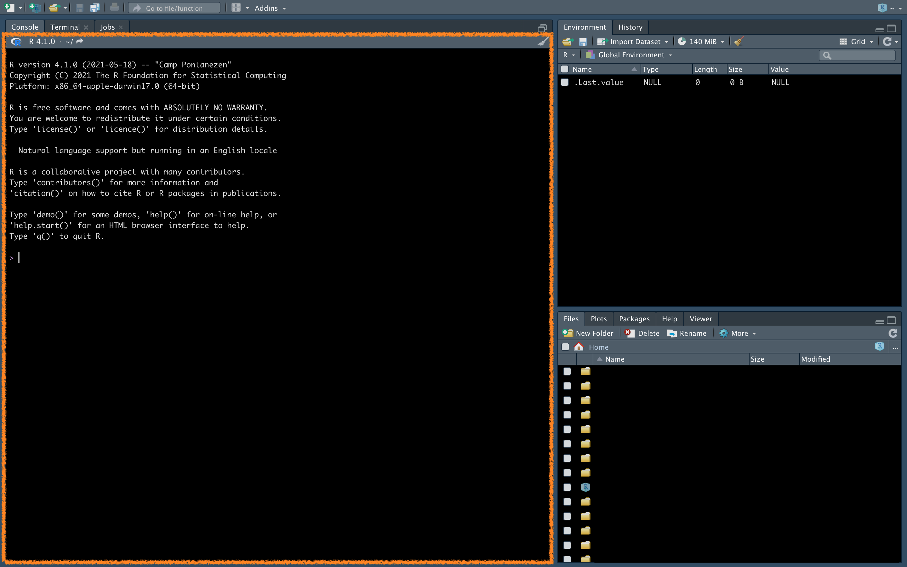

# First step in RStudio

Don't be intimidated by all these windows that you see open, we will slowly dig into them one by one.

## Console {.unnumbered}


Let's start from the console, that is the space where we will start writing the first commands and where their outputs are displayed.

Let's try a basic thing right away, using R as a calculator, type `2 + 2` on the console and press enter.

```{r}
2+2
```
<br>
Easy right? It returns `4`.
<br>
Now you can start playing a bit with the various operations, you can also write long expressions and you will see how the result will be shown immediately.

... <br>
Ok, but... usually we need the results of some operation to be saved, or often we want to use the same number several times without having to remember it, and this is where the concept of <em>variable</em> comes into play.
