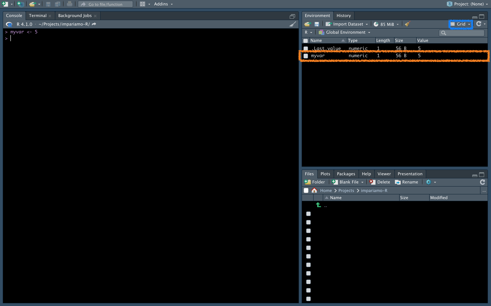

# Variabili
Come detto, spesso abbiamo bisogno che qualche numero (es una concentrazione), qualche tabella (es tabella dei differenziali), informazione (es il nome di una proteina) ecc siano salvati in R per poterli utilizzare successivamente nell'analisi. Ecco che entrano in gioco le <em>variabili</em>, e ora vedremo come salvarle, come riutilizzarle, e che tupi di variabili esistono.

## Salvare una variabile {-}
Per salvare una variabile si usa questa dicitura `nome_della_variabile <- cosa_salvare` (al posto di `<-` si può usare anche `=`, ma spesso questo viene usato all'interno delle funzioni per definire un argomento, ma lo vedremo più avanti). 
<br>
Scriviamo questo sulla console e vediamo cosa succede:

```{r}
myvar <- 5
```



Sulla console nulla, ma è apparso qualcosa nella finestra chiamata Environment (se la tua è diversa, può essere che ci sia l'impostazione vista "Lista" al posto di "Grid" nel riquadro azzurrino, puoi cambiarla a tuo piacimento). 
<br>
<p class="plist">Vediamo nel dettaglio queste informazioni:<p>
<ul>
  <li><strong>Name</strong>: il nome della variabile</li>
  <li><strong>Type</strong>: il tipo di variabile (vedremo più avanti di cosa si tratta)</li>
  <li><strong>Length:</strong>: la lunghezza della variabile (quanti elementi contiene)</li>
  <li><strong>Size</strong>: quanta memoria occupa quella variabile</li>
  <li><strong>Value</strong>: il valore della variabile, in questo caso 5</li>
</ul>

## Usare una variabile {-}
Per usare una variabile, ci basterà scrivere il nome della variabile nella console. Se, per esempio, volessimo calcolare il quadrato di 5, scriveremmo questo ora:
```{r}
myvar ** 2
```
Ed ecco che ci viene mostrato il risultato (per calcolare la potenza si può usare sia `**` sia `^`). 
<br>
E se volessimo salvare il risultato? Detto fatto, come prima:
```{r}
myvar_power <- myvar ** 2
print(myvar_power)
```

Usiamo `print(myvar_power)` per vedere qui il valore della variabile, avremmo potuto amche scrivere direttamente `myvar_power`. Vedremo più avanti quando è necessario usare print.

## Nomenclatura delle variabili {-}
Come in ogni cosa, anche nel nominare le variabili ci sono regole e linee guida. Non spaventarti, sono semplici e ti faciliteranno la vita, vediamole insieme.
<br>
<p class="plist">Regole:<p>
<ul>
  <li>il nome della variabile <strong>NON</strong> può iniziare con un carattere diverso da una lettera</li>
  <li>il nome può contenere sia lettere che numeri (case sensitive, maiuscole e minuscole contano)</li>
  <li>il nome può contenere come caratteri speciali <strong>solo</strong> il punto `.` o l'underscore `_`</li>
</ul>
<p class="plist">Linee guida:<p>
<ul>
  <li>dal momento che il nome delle variabili deve essere utile, il suo nome deve suggerire qualcosa: per esempio, precedentemente era stata definita la variabile `myvar`, il cui significato è pari a 0 (evita dunque questi nomi), mentre `myvar_power` è già più indicativo, in quanto ci dice che è elevato ad una potenza</li>
  <li>normalmente le variabili si scrivono con le lettere minuscole, tranne quelle che vuoi che rimangano costanti nella tua analisi, che in altri linguaggi si scrivono in maiuscolo (questo non le fa diventare immutabili, ma ci suggerisce questa caratteristica all'interno dello script)</li>
  <li>tra i caratteri speciali, usa l'underscore piuttosto che il punto se puoi</li>
  <li>se il nome della variabile contiene più di una parola, puoi separarle con l'underscore (come nell'esempio) o usare il camel case (myvarPower) o il Pascal case (MyvarPower)</li>
  <li>sii coerente all'interno dello script: se decidi di usare il Pascal case, usa sempre il Pascal case in quello script</li>
</ul>

## Sovrascrittura delle variabili {-}
Attenzione! Le variabili possono essere sovrascritte (azione <strong>irrimediabile</strong>).
<br>
Per sovrascrivere una variabile, basta assegnare a quella variabile un nuovo valore:
```{r}
print(myvar)
```


## Elencare le variabili {-}

## Eliminare le variabili {-}

## Esercizi {-}

Tipi di variabile nel prossimo