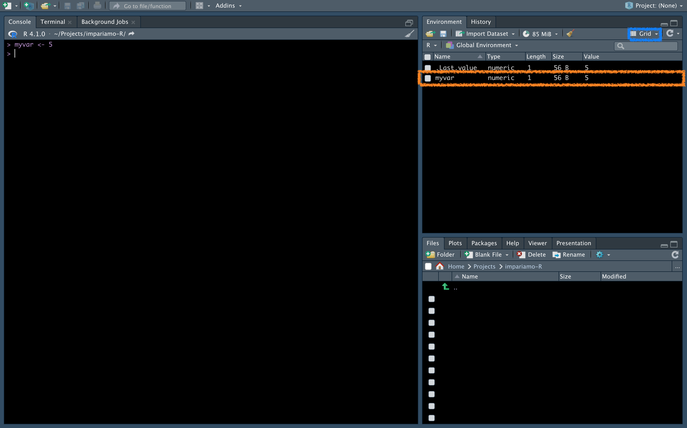

# Variables
As mentioned, we often need some number (eg a concentration), some table (eg table of differentially expressed genes), information (eg the name of a protein) etc. to be saved in R to be able to use them later in the analysis. This is where <em>variables</em> come into play, and now we'll see how to create them, how to reuse them, and what kinds of variables exist.

## Create a variable {-}
To create a variable we write `name_of_the_variable <- what_to_save` (you can either use `=` instead of `<-`, even if the former is usually used for declaring arguments in a function, but we'll see it later). 
<br>
Now, write this to the console, click Return/send on the keyborard, and see what happens:

```{r}
myvar <- 5
```



On the console nothing happens, but something appeared in the window called Environment (if yours is different, it may be that there is the "List" view setting instead of "Grid" in the blue box, you can change it to your liking).
<br>
<p class="plist">Here in details the info given for each variable:<p>
<ul>
  <li><strong>Name</strong>: name of the variable</li>
  <li><strong>Type</strong>: type of the variable (don't worry, we'll see in a minute what this means)</li>
  <li><strong>Length:</strong>: the length of the variable (how many items it contains)</li>
  <li><strong>Size</strong>: how much memory that variable occupies</li>
  <li><strong>Value</strong>: the value of our variable</li>
</ul>

If we want to create multiple variables with the same value we can do this:
```{r}
var1 <- var2 <- var3 <- 20
print(var1)
print(var2)
print(var3)
```


## Use a variable {-}
Ok, but once stored, how to we use a variable? Easy, we just need to type it in the console (or start writing the first letters of its name and press Tab to show RStudio suggestions). If, for example, we want to calculate the power of our variable we should write:
```{r}
myvar ** 2
```
And here is the result (to elevate to the power we can either use `**` or `^`). 
<br>
And what if we want to store this result? As before:
```{r}
myvar_power <- myvar ** 2
print(myvar_power)
```

Here we use `print()` function, but in R we can also just write the name of the variable to see it.

## Variable names {-}
As in everything, even in naming variables there are rules and guidelines. Don't be scared, they are simple and will make your life easier, let's see them together.
<br>
<p class="plist">Rules:<p>
<ul>
  <li>Variable name <strong>CANNOT</strong> start with a character other than a letter</li>
  <li>Variable name can contain both letters and numbers (case sensitive, uppercase and lowercase matter)</li>
  <li>Variable name may contain as special characters <strong>only</strong> the dot `.` or the underscore `_`</li>
</ul>
<p class="plist">Guidelines:<p>
<ul>
  <li>Since the name of the variable must be useful, its name must suggest something: for example, the variable `myvar` was previously defined, whose meaning is equal to 0 (so avoid these names), while ` myvar_power` is more indicative, as it tells us that it is raised to a power</li>
  <li>Variables are normally written in lowercase letters, except for those you want to remain constant in your analysis, which in other languages are written in uppercase (this does not make them immutable, but suggests this feature within the script)</li>
  <li>Use underscores rather than periods as special characters in variable names if you can</li>
  <li>If the variable name contains more than one word, you can separate them with an underscore (as in the example) or use the camel case (myvarPower) or the Pascal case (MyvarPower)</li>
  <li>Be consistent within the script: if you decide to use the Pascal case, always use the Pascal case in that script</li>
</ul>

## Overwriting variables {-}
Attention! Variables can be overwritten (<strong>unrecoverable</strong> action).
<br>
To override a variable, simply assign that variable a new value:
```{r}
print(myvar)

myvar <- 9

print(myvar)
```
Now `myvar` is equal to 9, and there is no way back...
<br>
This feature is useful for saving space and not cluttering up too much with variables that are okay to change often, but it can be risky. So be careful when naming variables.

## List all variables {-}
A useful way to avoid overwriting an important variable is to list the variables. We know that in RStudio they are all present in the <i>Environment</i> window, but what if we weren't in RStudio but elsewhere (for example in the terminal)?
<br>
The answer is simple, let's use the `ls()` function
```{r}
ls()
```

Here are our variables.
<br>
Note how I called this command with the name <em>function</em>: we will cover this concept later, for now you just need to know that they exist and that they can be identified immediately by the fact that after the name there is a pair of round brackets.
<br>


## Delete variables {-}
To delete a variable, use the `rm()` function and insert the variable to be deleted:
```{r}
# create a variable
to_remove <- 1213

# list all variables
ls()

# delete just-created variable
rm(to_remove)

# list all variables
ls()
```
As we see, in the second case the `to_remove` variable has been removed.
<br>
What if I want to remove multiple variables? Let's put multiple variable names inside the `rm()` function separated by commas:

```{r}
# create various variables
to_remove <- 1213
to_remove2 <- 685

# list all variables
ls()

# delete just-created variables
rm(to_remove, to_remove2)

# list all variables
ls()
```

The two variables have been removed.
<br>
But looking closely at these codes, we see that some start with `#` and are not evaluated. What are they? These are the <strong>comments</strong>, i.e. messages that you will write in the scripts (and we will see later how to create them) to help you understand what you are doing. They are actual comments that you can add, and will not be "evaluated" as code as the line starts with `#`.
<br>

## Type of variables {-}
So far so linear, right? Great, it will continue to be as easy 🙃.
<br>
<p class="plist">Let's see what are the basic types of variables that exist in R:</p>
<ul>
   <li><strong>Numeric</strong>: numbers, can be <em>integer</em> (whole numbers) or <i>double</i> (decimal numbers)</li>
   <li><strong>Character</strong>: characters, therefore strings of letters (words, sentences, etc.)</li>
   <li><strong>Boolean</strong>: `TRUE` or `FALSE`, are a special type of variable that R interprets in its own way, but super super super useful</li>
   <li><strong>Factor</strong>: similar to character, but with peculiar features (and memory saving), often used for categorical variables such as male/female, heterozygous/wild-type</li>
</ul>

We will see each type of variable in detail in next chapters. To find out what type a variable is we use the `typeof()` function:
```{r}
typeof(myvar)
```
We see that myvar is a double (although it is an integer value), this is because R basically interprets every number as a double, so as to increase its precision and the possibility of operations between various numbers without having type problems.

## Exercises {-}
Ok, this chapter was long enough, let's do some exercises to fix well these concepts.

::: {.exercise #create-variables}
Create 3 variables indicating the weights of 3 mice.
:::

<details>
  <summary>Solution</summary>
```{r}
mice1 <- 5.8
mice2 <- 4.8
mice3 <- 7.5

print(mice1)
print(mice2)
print(mice3)
```
</details>

::: {.exercise #sum-weights}
Create the variable `sum_weights` as the sum of the weights of those 3 mice.
:::

<details>
  <summary>Solution</summary>
```{r}
sum_weights <- mice1 + mice2 + mice3
print(sum_weights)
```
</details>

::: {.exercise #remove-variables}
Create 4 other variables for other 4 mice that weight 20 g. Then you realize you did a mistake and you choose to delete 3 of them and change the fourth to 7.7.
:::

<details>
  <summary>Solution</summary>
```{r}
# create 4 variables
mice4 <- mice5 <- mice6 <- mice7 <- 20

# list all variables
ls()

# delete 3 of the just-created variables
rm(mice5, mice6, mice7)

# list all variables
ls()

# change the value of one variable
mice4 <- 7.7

print(mice4)
```
</details>


Alright, if you have done all the exercises (and I'm sure you have), we can move on to the next chapter in which we briefly talk about scripts and saving the environment.